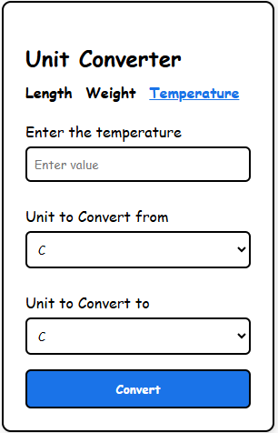

# 🌐 Unit Converter

Простое веб-приложение для конвертации величин: длина, вес и температура.  
Позволяет выбрать исходную и целевую шкалу, ввести значение и получить результат с точностью до 5 знаков после запятой (без лишних нулей).

## 📸 Скриншот

 <!-- Заменить или удалить, если нет изображения -->

## 🚀 Особенности

- Поддержка трёх типов измерений:
  - 📏 Длина (`m`, `cm`, `mm`, `km`, `in`, `ft`, `yd`, `mi`)
  - ⚖️ Вес (`kg`, `g`, `mg`, `lb`, `oz`)
  - 🌡 Температура (`C`, `F`, `K`)
- Адаптивный дизайн (работает на мобильных)
- Выпадающие списки вместо ручного ввода единиц измерения
- Чистое отображение результата: без лишних нулей после запятой
- Поддержка переключения между вкладками

## 🛠️ Установка

1. Клонируй репозиторий:
   ```bash
   git clone https://github.com/dayanik/unit-converter.git
   ```

2. Перейди в папку проекта:
   ```bash
   cd unit-converter
   ```

3. Открой `index.html` в браузере:

   - Дважды кликни по `index.html`  
   **или**
   - Запусти через локальный сервер:
     ```bash
     npx serve .
     ```

## 📁 Структура проекта

```
unit-converter/
│
├── index.html        # Главная HTML-страница
├── style.css         # Стили
├── script.js         # Логика конвертации
└── README.md         # Документация
```

## 🧪 Пример использования

1. Выбери вкладку: **Length**, **Weight** или **Temperature**.
2. Введи значение, выбери единицы "от" и "до".
3. Нажми **Convert** — и результат появится ниже.
4. Используй **Reset**, чтобы начать заново.

## 📱 Адаптивность

Сайт адаптирован для экранов мобильных устройств — удобный интерфейс и читабельность на телефонах и планшетах.

## 📄 Лицензия

MIT — свободно использовать, модифицировать и распространять.

---

✍️ Сделано с 💙 на чистом HTML, CSS и JavaScript.
